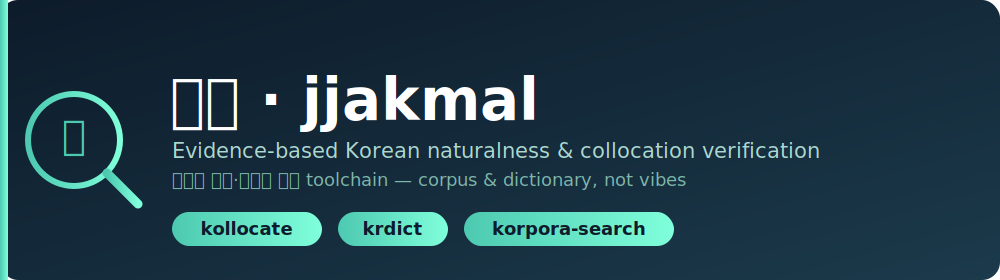
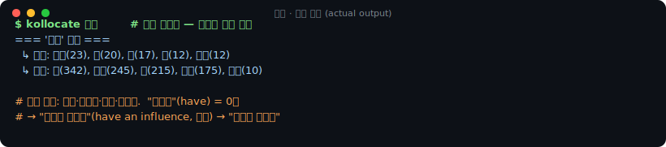
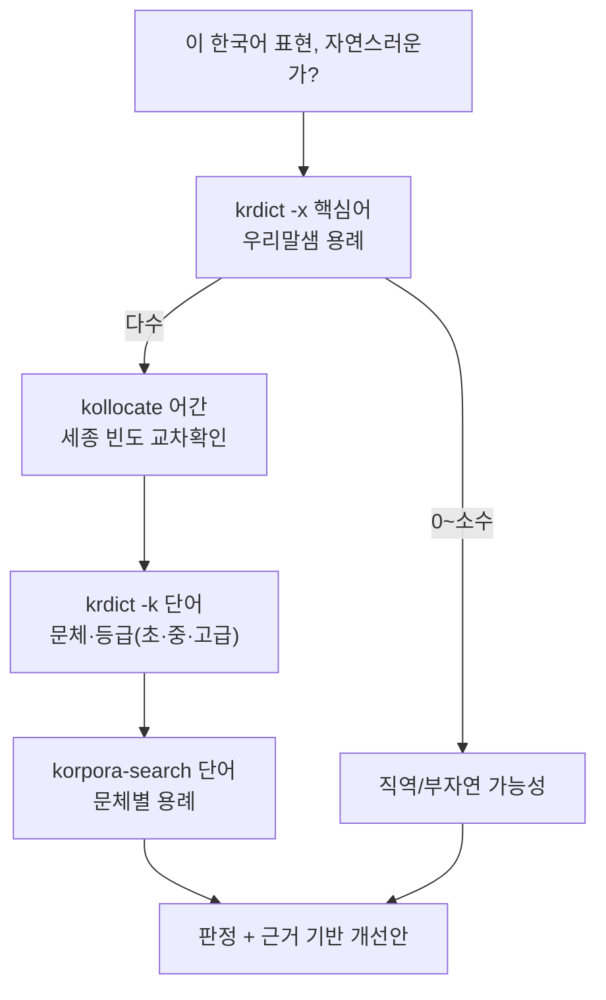

<p align="center">
  
</p>

<p align="center">
  <a href="https://github.com/carbonsteward/jjakmal/actions/workflows/ci.yml"></a>
  <a href="LICENSE"></a>
  
  
  
</p>

# 짝말 · jjakmal

<p align="center"><a href="README.md">English</a> · <b>한국어</b></p>

> **짝말** = 짝 + 말 — *서로 어울려 쓰이는 말*, 곧 연어(連語, collocation). 이 플러그인은 한국어
> 표현의 "짝"이 실제 말뭉치와 사전 용례에서 성립하는지 확인해 줍니다.

**한국어가 자연스러운지, 느낌이 아니라 근거로 가립니다.**

LLM은 한국어 연어와 문체 감각이 약합니다. "활성화를 뒷받침한다"처럼 실제로는 아무도 안 쓰는 표현도
자연스럽다고 자신 있게 말하죠. 짝말은 이런 어림짐작 대신, 말뭉치와 사전 용례를 CLI로 몇 초 만에
찾아봅니다. 그래서 "이건 번역투다"라는 판정에 막연한 느낌이 아니라 **실제 용례 162건**이 근거가
됩니다.

**Claude Code 플러그인**이며, 크게 네 가지로 이루어져 있습니다.

- 🧰 **독립 실행 CLI 도구 3종** — 누구나 사용 (`kollocate`, `krdict`, `korpora-search`)
- 🤖 **에이전트 스킬** — 언제 어떤 도구를 쓸지 알려주는 [skill](skills/korean-review/SKILL.md)
- ⌨️ **슬래시 명령** — 논문 단위(`/korean-audit`, `/korean-glossary`, `/korean-heatmap`, `/korean-fix`)와 표현 단위(`/korean-review`, `/korean-compare`)
- 🧠 **서브에이전트 2종** — `naturalness-reviewer`(의심 구간을 짚음) + `collocation-verifier`(근거 수집)

---

## 빠른 시작

**Claude Code 안에서** — 플러그인(스킬 + 명령 + 에이전트) 설치:

```text
/plugin marketplace add carbonsteward/jjakmal
/plugin install jjakmal@jjakmal
```

**셸에서** — 플러그인이 부르는 CLI 도구 설치:

```bash
git clone https://github.com/carbonsteward/jjakmal.git
cd jjakmal && ./install.sh
```

설치는 이걸로 끝입니다. CLI가 PATH에 없으면 플러그인이 셸 단계를 실행하라고 **한 번만** 알려 줄 뿐,
무엇도 알아서 설치하거나 사용자 환경을 건드리지 않습니다. 연어
검사는 키가 없어도 되어 `kollocate 뒷받침`이 바로 됩니다. 사전을 찾아보는 `krdict`에만 무료 키가
필요합니다 → [API 키](#api-키-krdict-전용) 참고. **KBASE와 URIMAL**부터 받으면 됩니다.

---

## 왜 필요한가

<p align="center"></p>
<p align="center"><sub><code>kollocate</code> 실제 출력을 카드로 렌더한 것입니다.</sub></p>

> 검토 대상 표현: **"영향을 가지다"** — 영어 *have an influence*의 직역.

```
$ kollocate 영향            # 세종 말뭉치 — 영향과 실제로 어울리는 동사
  [명사] ↳ 동사: 받(342), 미치(245), 주(215), 끼치(175), 의하(10)
  → 자연 동사는 받다 / 미치다 / 주다 / 끼치다.  가지다("have") = 0건
```

**도구가 주는 것:** 판정이 아니라 근거입니다. 영향은 미치다/주다/끼치다와 수백 번 어울리고
가지다("have")와는 **0번** 어울립니다 — 그래서 "영향을 가지다"는 말뭉치에 근거 없는 번역투이고,
자연스러운 형태는 **"영향을 미치다"**입니다. 도구는 재현 가능한 빈도를 보여주고, 판단은 사람이 합니다.
(반대로 LLM은 "영향을 가지다"를 자신 있게 괜찮다고 말합니다.)

---

## 도구 구성

어떤 질문을 할 때 어떤 도구를 쓰는지 정리했습니다.

| 도구 | 답하는 질문 | 데이터 출처 | API 키 |
|------|-------------|-------------|:---:|
| **`kollocate <어간>`** | 이 단어와 자주 같이 쓰는 말은? 얼마나 자주? | 세종 말뭉치(품사 태깅 빈도) | ❌ |
| **`korpora-search <단어>`** | 이 단어가 실제로 쓰인 문장을 문체별로 보여줘 | 한국어 말뭉치 27종(영화평·청원·뉴스·위키…) | ❌ |
| **`krdict <단어>`** | 뜻풀이, 문체/등급, 그리고 **실제 용례** | 국립국어원 사전 3종(표준국어대사전·우리말샘·한국어기초사전) | ✅ 무료 |



---

## 설치

**1. 플러그인** (스킬 + 명령 + 에이전트) — Claude Code에서:

```
/plugin marketplace add carbonsteward/jjakmal
/plugin install jjakmal@jjakmal
```

**2. CLI 런타임** (플러그인이 부르는 실행 파일) — 셸에서:

```bash
git clone https://github.com/carbonsteward/jjakmal.git
cd jjakmal
./install.sh            # pip 의존성 + kollocate/krdict/korpora-search 를 ~/.local/bin 에 심볼릭 링크
# ./install.sh --skill  # 플러그인 없이 쓸 때: 스킬만 ~/.claude/skills 에 링크
```

설치 스크립트는 `pip install -r requirements.txt`([Kollocate](https://github.com/Kyubyong/kollocate),
[Korpora](https://github.com/ko-nlp/Korpora))를 실행하고 도구 3종을 링크합니다. `~/.local/bin`이
`PATH`에 없으면 추가하세요. CLI는 플러그인으로 쓰든 단독으로 쓰든 모두 필요합니다.

> **설치 안내(자동 설치 아님):** 플러그인의 `SessionStart` 훅(`hooks/bootstrap-cli.sh`)은 CLI가
> 없을 때 `./install.sh`를 실행하라고 **한 번만** 알려 줍니다. 일부러 직접 설치는 하지 않습니다 —
> 플러그인이 동의 없이 `pip install`을 돌리거나 PATH를 바꾸면 안 되니까요. 안내는 한 번만 뜨고
> (`~/.cache/jjakmal/.cli-nudge-shown`로 표시), 이후로는 조용합니다. 아예 끄려면 플러그인 설치 전에
> `hooks/`를 지우세요.

### API 키 (`krdict` 전용)

`kollocate`와 `korpora-search`는 **키가 없어도 됩니다** — `install.sh`가 끝나면 바로 쓸 수 있습니다.
사전을 찾아보는 `krdict`에만 국립국어원 오픈 API 키가 필요한데, **무료**입니다. **하나만** 받아도
됩니다 — 학습자 사전(`KBASE` ⭐) 하나로 자연성 검토는 거의 다 됩니다.

**키 받는 법 (사전마다 따로):**

1. 아래 사전의 오픈 API 페이지에서 **무료로 회원가입하고 로그인**합니다.
2. **인증키 신청**을 찾아 양식을 제출하면 **32자리 16진수 키**를 줍니다.
3. 셸 설정 파일에 넣어 영구 적용한 뒤 다시 불러옵니다.

   ```bash
   # ~/.zshrc  (또는 ~/.bashrc)
   export KRDICT_KBASE_KEY=발급받은32자리키      # 한국어기초사전  ⭐ 여기부터
   export KRDICT_URIMAL_KEY=발급받은32자리키      # 우리말샘 — `krdict -x` 용례에 필요 ⭐
   export KRDICT_STDICT_KEY=발급받은32자리키      # 표준국어대사전  (선택)
   ```
   ```bash
   source ~/.zshrc
   ```
4. 확인: `krdict -k 활성화`는 뜻풀이를(KBASE 키), `krdict -x 뒷받침`은 용례를(URIMAL 키) 보여줘야
   합니다.

| 환경변수 | 사전 | 신청처 | 받으면 좋은 이유 |
|---|---|---|---|
| `KRDICT_KBASE_KEY` ⭐ | 한국어기초사전 | https://krdict.korean.go.kr/openApi/openApiInfo | 등급/문체 + 11개 언어 번역 |
| `KRDICT_URIMAL_KEY` ⭐ | 우리말샘 | https://opendict.korean.go.kr/service/openApiInfo | `krdict -x`(가장 강력한 연어 검사)에 필요 |
| `KRDICT_STDICT_KEY` | 표준국어대사전 | https://stdict.korean.go.kr/openapi/openApiInfo.do | 표준어 규범에 따른 가장 엄밀한 뜻풀이 |

> 이 저장소는 **키도 사전 데이터도 담지 않습니다**. `krdict`는 사용자 본인 키로 받은 응답을 보기
> 좋게 정리해 줄 뿐입니다. 키는 사전마다 따로 신청해야 하고, 한 키를 다른 사전에 쓰면 `error 020
> Unregistered key`가 납니다. 키가 없으면 `krdict`가 신청 주소를 함께 알려 주고, 있는 키만으로 계속
> 동작합니다.

---

## 사용법

```bash
# 연어 빈도 — 동사·형용사는 -다 어미를 떼고 어간만
kollocate 활성화
kollocate 먹 --top 5 --json

# 사전
krdict 활성화            # 표준국어대사전 (기본)
krdict -k 활성화                  # 한국어기초사전 — 등급(초급/중급/고급)
krdict -k 활성화 --translated     # + 영어 번역 (--trans-lang 1=영 2=일 3=프 … 11=중)
krdict -x 뒷받침         # ⭐ 우리말샘 용례 = 최강 연어 검사
krdict -a 활성화         # 사전 3종 동시

# 말뭉치 용례
korpora-search --list
korpora-search 활성화 --download nsmc
korpora-search 활성화 --corpus korean_petitions --limit 10   # 격식체
```

**자연성 검토에 권장하는 말뭉치:** `nsmc`(영화평, 구어), `korean_petitions`(격식체 — 정책·보고서
검토에 적합), `kcbert`(댓글), `kowikitext`(백과체). 국립국어원 `modu_*` 말뭉치는
[corpus.korean.go.kr](https://corpus.korean.go.kr)에서 따로 인증을 받아야 합니다.

---

## 플러그인 구성 요소

설치하면 에이전트는 작업 흐름을 익히고, 사용자는 바로 쓸 수 있는 명령을 얻습니다.

> **이름 안내:** 플러그인·저장소·마켓플레이스 이름은 **`jjakmal`**, 그 안의 스킬과 슬래시 명령은
> 설명적 이름인 **`korean-review`**입니다. 한 프로젝트의 의도된 두 이름 — `jjakmal`은 패키지,
> `korean-review`는 하는 일.

### 슬래시 명령

**논문 단위** (보통 이 범위 — 보고서 한 편, 파일, 또는 챕터 디렉터리):

| 명령 | 하는 일 |
|---|---|
| `/korean-audit <파일\|디렉터리>` | 전체 자연성 감사 — 논문 전체에 병렬 fan-out, 번역투 적발, 최악은 근거 검증, **하나의 심각도별 편집 리포트**(`NATURALNESS_AUDIT.md`) 산출. `--quick`은 빠른 플래그만 |
| `/korean-glossary <파일\|디렉터리>` | 용어 감사 — 반복 용어 추출, 같은 개념이 섹션마다 다르게 번역됐는지 적발, 사전·말뭉치 근거로 **통합 권장 용어** 제시 |
| `/korean-heatmap <파일\|디렉터리>` | 번역투 트리아지 — 섹션별 "기계번역처럼 읽히는 정도"를 점수화·랭킹, **어디부터 손볼지** 알려줌 |
| `/korean-fix <파일>` | 감사 결과를 섹션 단위로 적용(의미·수치·구조 보존) 후 재검사; `--dry-run`은 diff만 |

**표현 단위** (한 표현):

| 명령 | 하는 일 |
|---|---|
| `/korean-review <표현>` | 표현 하나 판정 — 근거 + 개선안 |
| `/korean-compare <A> vs <B>` | 두 표현 A·B 비교 — 더 자연스러운 쪽 |

### 서브에이전트

- **`naturalness-reviewer`** — 한국어 글을 훑어 9가지 패턴(번역투 주어, 직역 추상명사구, 영어 은유
  직역, 문체 불일치 등)으로 의심 구간을 **짚어 줍니다**. 직접 고치지는 않고, 정리된 JSON으로
  돌려줍니다.
- **`collocation-verifier`** — 짚어 준 표현 하나를 받아 CLI를 돌려, 근거에 기반한 판정과 개선안을
  내놓습니다. 매번 같은 결과를 내며, 직관에 기대지 않습니다.

논문 단위 명령(`/korean-audit`, `/korean-heatmap`)이 둘을 엮습니다: 리뷰어가 모든 섹션을 **동시에**
짚고, 위험한 곳마다 검증기가 근거를 붙입니다.

### 한국어 초안마다 감사 강제 (opt-in)

LLM이 쓰는 한국어 초안마다 자동 감사를 원하시나요? 플러그인은 게이트 스크립트 2개를 담습니다.
**자동 등록은 안 합니다** — 원치 않는 사람은 비용 0 — 직접 `~/.claude/settings.json`에 켜세요.
`./install.sh --gate`로 경로 맞춰진 스니펫을 출력받거나, 직접 추가:

```jsonc
{
  "hooks": {
    // 알림: 한국어 Write/Edit 후 /korean-audit 돌리라고 모델에 알림 (차단 불가 — PostToolUse는 쓰기 뒤에 실행)
    "PostToolUse": [{ "matcher": "Write|Edit|MultiEdit",
      "hooks": [{ "type": "command", "command": "bash /절대/경로/jjakmal/hooks/enforce-korean-audit.sh" }] }],
    // 강제: /korean-audit 돌릴 때까지 턴 종료를 차단 (Stop 훅은 차단 가능)
    "Stop": [{ "hooks": [{ "type": "command", "command": "bash /절대/경로/jjakmal/hooks/enforce-korean-stop.sh" }] }]
  }
}
```

하드 강제는 **둘 다** 추가(Stop 훅이 `/korean-audit` 실행 전까지 턴을 못 끝내게 막고, 감사가 게이트를
풉니다). 비차단 알림만 원하면 **PostToolUse만** 추가. `JJAKMAL_KOREAN_GATE_MINLEN`(기본 20자 ≈ 한
문장)으로 트리거 조절. 훅은 쓰여진 텍스트를 읽기만 하고 실행하지 않습니다. 끄려면 settings.json에서
제거하세요.

> **정직 노트:** `PostToolUse` 훅은 쓰기 *뒤에* 실행되므로 차단·되돌리기를 못 합니다 — 알림만
> 가능. 진짜 "감사 전엔 못 끝냄" 강제는 **Stop** 훅이 합니다.

### 스킬

[`skills/korean-review/SKILL.md`](skills/korean-review/SKILL.md)가 핵심 에이전트 스킬입니다. 한국어
표현이 의심스러우면 Claude가 알아서 이 도구들을 골라 써서, 직관 대신 **근거 자료**를 내놓도록
안내합니다. 함께 담긴 [`references/`](skills/korean-review/references/) 폴더에는 국립국어원 오픈 API
명세 전체(의미 범주 154개, 학습 시나리오 107개, 품사 코드, 11개 언어 표)와 원본 도구의 README가 들어
있어, 설치한 뒤에는 오프라인에서도 쓸 수 있습니다.

> **이 저장소의 한국어 문서는 도구 자체로 검수했습니다.** `kollocate`와 `krdict -x`로 훑어, AI가 흔히
> 쓰는 직역투를 실제로 찾아 고쳤습니다. 예를 들어 "근거 계층"(영어 *layer*의 직역)은 우리말샘 용례
> 536건에서 "계층"이 모두 "저소득·취약 계층" 같은 사회 계층으로만 쓰여, 어색하다는 게 바로
> 드러났습니다.

---

## 자매 프로젝트 — Humanize KR

짝말은 근거를 대 주는 **검증 도구**이고, [**Humanize KR**](https://github.com/epoko77-ai/im-not-ai)(`im-not-ai`)은
글을 다듬어 주는 **윤문 도구**입니다. Humanize KR은 40여 가지 패턴으로 한국어에서 AI 티를 걷어내고,
짝말은 어떤 표현이 자연스러운지를 말뭉치와 사전 용례로 직접 확인해 줍니다. Humanize KR로 다듬은 뒤,
짝말로 그 결과가 정말 자연스러운지 확인하면 됩니다. 두 도구가 바라는 건 같습니다. 기계가 쓴 티가
안 나는 한국어죠. 다만 한쪽은 고치고 한쪽은 확인하는, 서로 다른 역할을 맡을 뿐입니다.

---

## 한계 / 주의

- **세종 말뭉치는 1998–2007년 텍스트입니다** — 최신 신조어에는 약하니 우리말샘이나 `kcbert`로
  보완하세요.
- **`kollocate`는 어간으로 넣어야 합니다** — 종결 어미를 붙이면 결과가 0건이 됩니다(`먹`이 맞고,
  `먹다`는 안 됨).
- **말뭉치마다 라이선스가 다릅니다** — Korpora가 여러 말뭉치를 내려받으니, 다시 쓰기 전에 각
  라이선스를 확인하세요.
- **원어민 편집자를 대신하지는 못합니다** — 근거를 보여 줄 뿐, 최종 판단은 사람 몫입니다.

---

## 출처 표기

이 프로젝트는 이미 훌륭하게 만들어진 도구들 위에 가벼운 껍데기와 에이전트 흐름만 얹은 것입니다.
자세한 내용은 [`NOTICE`](NOTICE)를 참고하세요.

- **[Kollocate](https://github.com/Kyubyong/kollocate)** — Kyubyong Park · Apache-2.0 · (세종 말뭉치, 국립국어원)
- **[Korpora](https://github.com/ko-nlp/Korpora)** — ko-nlp · CC-BY-4.0
- **표준국어대사전 · 우리말샘 · 한국어기초사전** 오픈 API — 국립국어원

위 어느 곳과도 제휴하거나 보증받은 사이는 아닙니다.

## 기여

이슈와 PR 환영합니다 — 특히 새 자연성 패턴, `korpora-search`에 붙일 말뭉치 어댑터, `krdict` 옵션
확대가 반갑습니다. 도구는 되도록 의존성을 줄이고, 키 없이도 쓸 수 있게 유지해 주세요.

## 라이선스

원작(`bin/` 래퍼와 `SKILL.md`)은 **MIT** © 2026 carbonsteward — [`LICENSE`](LICENSE) 참고.
함께 담기거나 의존하는 구성요소는 각자의 라이선스를 따릅니다. [`NOTICE`](NOTICE) 참고.
