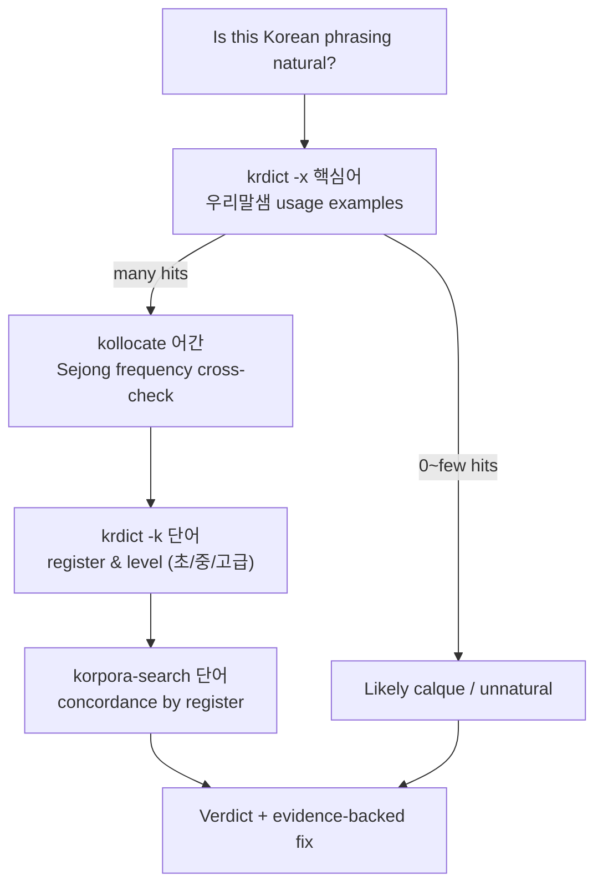

<p align="center">
  
</p>

<p align="center">
  <a href="https://github.com/carbonsteward/jjakmal/actions/workflows/ci.yml"></a>
  <a href="LICENSE"></a>
  
  
  
</p>

# 짝말 · jjakmal

<p align="center"><b>English</b> · <a href="README.ko.md">한국어</a></p>

> **짝말** = 짝(pair) + 말(word) — *words that belong together*, i.e. collocation. The plugin checks
> whether your Korean phrasing's 짝 actually hold up against real corpus + dictionary evidence.

**Objective evidence for Korean naturalness — not LLM gut feeling.**

LLMs are weak at Korean collocation (연어) and register intuition: they will confidently
tell you "활성화를 뒷받침한다" is fine when no Korean writer says it. **짝말 (jjakmal)** replaces
that guesswork with **corpus and dictionary evidence you can query from the CLI in seconds** —
so a claim like *"this phrasing is a translationese calque"* comes with 162 real usage examples
behind it, not a vibe.

It ships as a **Claude Code plugin** bundling four layers:

- 🧰 **Three standalone CLI tools** anyone can use (`kollocate`, `krdict`, `korpora-search`)
- 🤖 **An [Agent Skill](skills/korean-review/SKILL.md)** that teaches an agent *when* and *how* to call them
- ⌨️ **Slash-commands** — paper-wide (`/korean-audit`, `/korean-glossary`, `/korean-heatmap`, `/korean-fix`) and phrase-level (`/korean-review`, `/korean-compare`)
- 🧠 **Two subagents** — `naturalness-reviewer` (flags spans) + `collocation-verifier` (gathers evidence)

---

## Quickstart

**In Claude Code** — install the plugin (skill + commands + agents):

```text
/plugin marketplace add carbonsteward/jjakmal
/plugin install jjakmal@jjakmal
```

**In a shell** — install the CLI tools the plugin calls:

```bash
git clone https://github.com/carbonsteward/jjakmal.git
cd jjakmal && ./install.sh
```

That's it. If the CLIs aren't on your PATH, the plugin **reminds you once** to run the shell step —
it never installs anything silently or touches your Python environment on its own. No keys needed for
collocation — `kollocate 뒷받침` works immediately. Dictionary lookups
(`krdict`) need free keys → [jump to API keys](#api-keys-only-for-krdict); start with **KBASE +
URIMAL**.

---

## Why

<p align="center"></p>
<p align="center"><sub>Real <code>kollocate</code> output, rendered as a card.</sub></p>

> Phrase under review: **"영향을 가지다"** — a literal rendering of English *"have an influence"*.

```
$ kollocate 영향            # Sejong corpus — which verbs actually go with 영향
  [명사] ↳ 동사: 받(342), 미치(245), 주(215), 끼치(175), 의하(10)
  → the natural verbs are 받다 / 미치다 / 주다 / 끼치다.  가지다 ("have") = 0
```

**What the tool gives you:** evidence, not a verdict. 영향 collocates with 미치다/주다/끼치다 hundreds
of times and with 가지다 ("have") **zero** times — so "영향을 가지다" is unattested translationese, and
the natural form is **"영향을 미치다"**. The tool surfaces the reproducible counts; you make the call.
(Contrast the LLM, which will confidently call "영향을 가지다" fine.)

---

## The toolchain

| Tool | What it answers | Data source | API key? |
|------|-----------------|-------------|:---:|
| **`kollocate <어간>`** | Which words co-occur with this one, and how often? | Sejong Corpus (POS-tagged frequency) | ❌ |
| **`korpora-search <단어>`** | Show me real sentences using this word, by register | 27 Korean corpora (movie reviews, petitions, news, wiki…) | ❌ |
| **`krdict <단어>`** | Definition, register/level, and **real usage examples** | 3 NIKL dictionaries (표준국어대사전 · 우리말샘 · 한국어기초사전) | ✅ free |



---

## Install

**1. The plugin** (skill + commands + agents) — from Claude Code:

```
/plugin marketplace add carbonsteward/jjakmal
/plugin install jjakmal@jjakmal
```

**2. The CLI runtime** (the binaries the plugin calls) — from a shell:

```bash
git clone https://github.com/carbonsteward/jjakmal.git
cd jjakmal
./install.sh            # pip deps + symlinks kollocate/krdict/korpora-search into ~/.local/bin
# ./install.sh --skill  # for non-plugin use: also link just the skill into ~/.claude/skills
```

The installer runs `pip install -r requirements.txt` ([Kollocate](https://github.com/Kyubyong/kollocate),
[Korpora](https://github.com/ko-nlp/Korpora)) and symlinks the three tools. Add `~/.local/bin` to your
`PATH` if it isn't already. The CLIs are required for both the plugin and standalone CLI use.

> **Install reminder (not auto-install):** the plugin includes a `SessionStart` hook
> (`hooks/bootstrap-cli.sh`) that, if the CLIs are missing, prints a **one-time** hint to run
> `./install.sh`. It deliberately does **not** install anything itself — a plugin shouldn't run
> `pip install` or change your PATH without consent. The reminder shows once (guarded by
> `~/.cache/jjakmal/.cli-nudge-shown`) and stays quiet afterward. To silence it entirely, remove
> `hooks/` before installing.

### API keys (only for `krdict`)

`kollocate` and `korpora-search` need **no keys** — they work the moment `install.sh` finishes.
Only `krdict` (dictionary lookups) needs keys, from the National Institute of Korean Language
(국립국어원) Open APIs. They're **free**. You can start with **just one** — the learner dictionary
(`KBASE`, the ⭐ one) covers most naturalness work on its own.

**How to get a key (repeat per dictionary you want):**

1. Open the dictionary's Open API page (links below) and **create a free account / log in** (the
   sites are Korean — a browser translate extension helps).
2. Find **인증키 신청** ("apply for authentication key") and submit the form. You'll be issued a
   **32-character hex key**.
3. Add it to your shell rc so it persists, then reload:

   ```bash
   # ~/.zshrc  (or ~/.bashrc)
   export KRDICT_KBASE_KEY=your32hexkeyhere     # 한국어기초사전  ⭐ start here
   export KRDICT_STDICT_KEY=your32hexkeyhere     # 표준국어대사전  (optional)
   export KRDICT_URIMAL_KEY=your32hexkeyhere     # 우리말샘 — needed for `krdict -x` 용례 ⭐
   ```
   ```bash
   source ~/.zshrc
   ```
4. Verify: `krdict -k 활성화` should return definitions (KBASE key), and `krdict -x 뒷받침`
   should return usage examples (URIMAL key).

| Env var | Dictionary | Register at | Why you'd want it |
|---|---|---|---|
| `KRDICT_KBASE_KEY` ⭐ | 한국어기초사전 | https://krdict.korean.go.kr/openApi/openApiInfo | level/register + 11-language gloss |
| `KRDICT_URIMAL_KEY` ⭐ | 우리말샘 | https://opendict.korean.go.kr/service/openApiInfo | powers `krdict -x` (the #1 collocation check) |
| `KRDICT_STDICT_KEY` | 표준국어대사전 | https://stdict.korean.go.kr/openapi/openApiInfo.do | strict canonical definitions |

> This repo ships **no keys and no dictionary data**. `krdict` only formats the responses returned to
> *your* key at runtime. Each NIKL key is a **separate** registration — reusing one on another
> endpoint returns `error 020 Unregistered key`. If a key is missing, `krdict` prints a warning with
> the signup URL and continues with whatever keys you do have.

---

## Usage

```bash
# 연어 (collocation) frequency — verb/adjective stems drop the -다 ending
kollocate 활성화
kollocate 먹 --top 5 --json

# Dictionaries
krdict 활성화            # 표준국어대사전 (default)
krdict -k 활성화                  # 한국어기초사전 — learner level (초급/중급/고급)
krdict -k 활성화 --translated     # + English gloss (--trans-lang 1=en 2=ja 3=fr … 11=zh)
krdict -x 뒷받침         # ⭐ 우리말샘 usage examples = the #1 collocation check
krdict -a 활성화         # all three dictionaries at once

# Corpus concordance
korpora-search --list
korpora-search 활성화 --download nsmc
korpora-search 활성화 --corpus korean_petitions --limit 10   # formal register
```

**Recommended corpora for naturalness work:** `nsmc` (movie reviews, colloquial),
`korean_petitions` (formal — fits policy/report review), `kcbert` (comments), `kowikitext`
(encyclopedic). NIKL `modu_*` corpora require separate authentication at
[corpus.korean.go.kr](https://corpus.korean.go.kr).

---

## Plugin components

Once installed, the plugin gives an agent the workflow and gives you direct commands.

> **On naming:** the plugin, repo, and marketplace are **`jjakmal`**; the skill and its slash-commands
> are named **`korean-review`** (descriptive). One project, two names — `jjakmal` is the package,
> `korean-review` is what it does.

### Slash-commands

**Paper-wide** (the usual scope — a whole report, file, or directory of chapters):

| Command | What it does |
|---|---|
| `/korean-audit <file\|dir>` | Full-document naturalness audit — fans out across the paper, flags translationese, verifies the worst with evidence, and writes one consolidated, severity-ranked editorial report (`NATURALNESS_AUDIT.md`). `--quick` = fast flag-only pass |
| `/korean-glossary <file\|dir>` | Terminology audit — extracts recurring terms, flags the same concept translated inconsistently across sections, recommends one canonical term each with dictionary/corpus evidence |
| `/korean-heatmap <file\|dir>` | Translationese triage — scores each section by how machine-translated it reads and ranks them, so you know where to edit first |
| `/korean-fix <file>` | Applies the audit's fixes section by section (meaning/numbers/structure preserved), then re-checks; `--dry-run` shows a diff |

**Phrase-level** (for a single expression):

| Command | What it does |
|---|---|
| `/korean-review <phrase>` | Single-phrase verdict — evidence block + fix |
| `/korean-compare <A> vs <B>` | A-vs-B showdown — evidence for both, picks the more natural |

### Subagents

- **`naturalness-reviewer`** — walks Korean text and flags spans by a 9-pattern taxonomy
  (translationese subjects, calqued abstractions, English-metaphor calques, register mismatches, …).
  It *flags*; it doesn't rewrite. Returns structured JSON.
- **`collocation-verifier`** — takes one flagged phrase and runs the CLIs to return an
  evidence-backed verdict + fix. Deterministic — never judges from intuition.

The paper-wide commands (`/korean-audit`, `/korean-heatmap`) compose them: the reviewer flags across
every section **in parallel**, then a verifier attaches evidence per high-severity span.

### Enforce an audit on every Korean draft (opt-in)

Want every Korean draft an LLM writes to get audited automatically? The plugin ships two gate scripts.
They are **not auto-registered** — so users who don't want this pay nothing — you enable them in your
own `~/.claude/settings.json`. Run `./install.sh --gate` to print a ready-to-paste snippet with the
correct paths, or add it by hand:

```jsonc
{
  "hooks": {
    // reminder: after a Korean Write/Edit, tells the model to run /korean-audit (cannot block —
    // PostToolUse fires after the write)
    "PostToolUse": [{ "matcher": "Write|Edit|MultiEdit",
      "hooks": [{ "type": "command", "command": "bash /ABS/PATH/jjakmal/hooks/enforce-korean-audit.sh" }] }],
    // enforcement: blocks the turn from ending until /korean-audit runs (Stop hooks CAN block)
    "Stop": [{ "hooks": [{ "type": "command", "command": "bash /ABS/PATH/jjakmal/hooks/enforce-korean-stop.sh" }] }]
  }
}
```

Add **both** for hard enforcement (the Stop hook won't let the turn finish until you run
`/korean-audit`, which clears the gate); add **only the PostToolUse** one for non-blocking reminders.
`JJAKMAL_KOREAN_GATE_MINLEN` (default 20 Hangul chars ≈ a sentence) tunes the trigger. The hooks only
read the written text; they never execute it. Remove them from `settings.json` to turn it off.

> **Honesty note:** a `PostToolUse` hook fires *after* the write, so it cannot block or undo it — it
> can only remind. Real "won't finish until audited" enforcement comes from the **Stop** hook.

### The skill

[`skills/korean-review/SKILL.md`](skills/korean-review/SKILL.md) is the self-contained Agent Skill —
Claude reaches for these tools automatically whenever you question a Korean expression, and is
instructed to produce an **evidence block** instead of an intuition. The bundled
[`references/`](skills/korean-review/references/) folder carries the full NIKL Open API specs (154
semantic categories, 107 learning scenarios, POS codes, 11-language tables) and the upstream tool
READMEs, so it works offline once installed.

---

## Sister project — Humanize KR

korean-review is the **evidence layer**; [**Humanize KR**](https://github.com/epoko77-ai/im-not-ai)
(`im-not-ai`) is the **rewriter**. Humanize KR *removes* AI tells from Korean text using a
40+-pattern taxonomy; korean-review *proves* whether a given phrasing is natural with reproducible
corpus + dictionary evidence. Use Humanize KR to fix, and korean-review to verify the fix held up.
They share the same goal — Korean that doesn't read like a machine wrote it — from opposite ends.

---

## Limitations

- **Sejong corpus is 1998–2007 text** — weak on recent neologisms. Cross-check with 우리말샘 / `kcbert`.
- **`kollocate` needs stems** — pass `먹`, not `먹다` (final ending → 0 results).
- **Per-corpus licenses vary** — Korpora downloads many corpora; verify each one's license before reuse.
- **Not a substitute for a native editor** — it surfaces *evidence*; a human still makes the call.

---

## Attribution

This project is thin wrappers + an agent workflow around excellent upstream work. Full details in
[`NOTICE`](NOTICE):

- **[Kollocate](https://github.com/Kyubyong/kollocate)** — Kyubyong Park · Apache-2.0 · (Sejong Corpus, 국립국어원)
- **[Korpora](https://github.com/ko-nlp/Korpora)** — ko-nlp · CC-BY-4.0
- **표준국어대사전 · 우리말샘 · 한국어기초사전** Open APIs — National Institute of Korean Language (국립국어원)

Not affiliated with or endorsed by any of the above.

## Contributing

Issues and PRs welcome — especially new naturalness patterns, additional corpus adapters in
`korpora-search`, and `krdict` option coverage. Keep the tools dependency-light and key-free where
possible.

## License

Original work (the `bin/` wrappers and `SKILL.md`) is **MIT** © 2026 carbonsteward — see [`LICENSE`](LICENSE).
Bundled/depended-upon components retain their own licenses; see [`NOTICE`](NOTICE).
